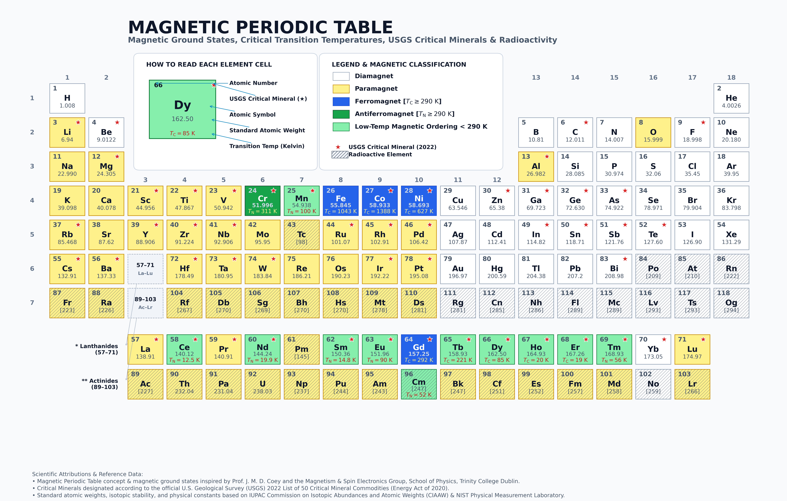
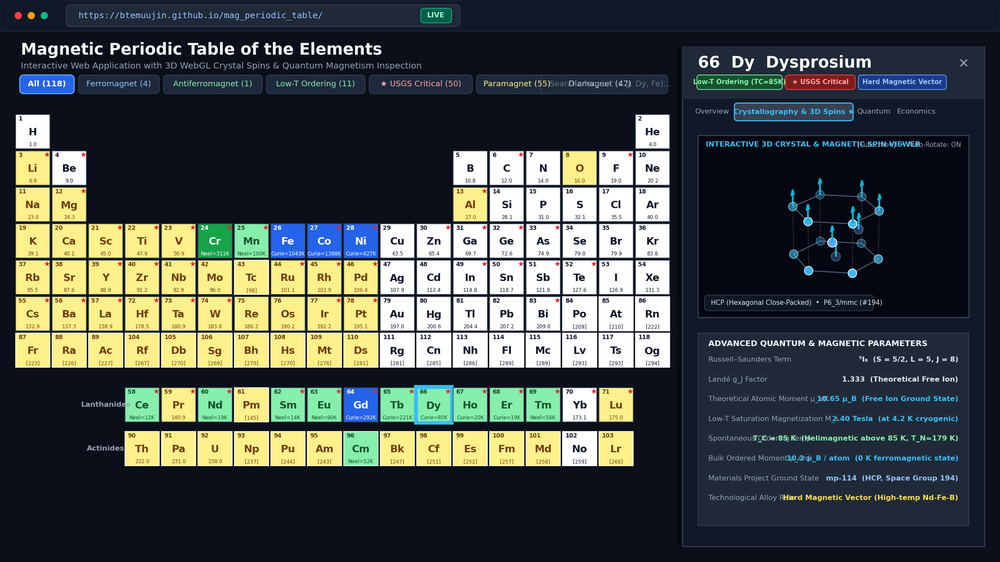

# Magnetic Periodic Table & Critical Minerals Visualization

[](https://btemuujin.github.io/mag_periodic_table/)
[](https://www.python.org/)
[](LICENSE)

> 🚀 **Live Interactive Web Application**: [https://btemuujin.github.io/mag_periodic_table/](https://btemuujin.github.io/mag_periodic_table/)
>
> 📖 *For complete derivations, comprehensive physical data tables, and in-depth architecture, consult the [Full Scientific Specification (README_LONG.md)](README_LONG.md).*

---

## Overview

A publication-grade scientific periodic table visualization and interactive web application that classifies all **118 chemical elements** by their:
- **Intrinsic Magnetic Ground States** (diamagnetic, paramagnetic, ferromagnetic, antiferromagnetic, and low-temperature ordering).
- **Critical Magnetic Transition Temperatures** (Curie $T_{\mathrm{C}}$ and Néel $T_{\mathrm{N}}$).
- **USGS Critical Minerals Designation** (official 2022 framework, 50 elements).
- **Radioactive Stability** (37 unstable elements).
- **Quantum & Solid-State Parameters** (Russell–Saunders term symbols, Landé $g_J$-factors, Hund's rule moments, Fermi-level spin polarization, and 79 vetted Materials Project crystal structures).

Inspired by the foundational work of **Prof. J. M. D. Coey** (*Magnetism and Magnetic Materials*, Cambridge University Press, 2010) and the Magnetism & Spin Electronics Group at **Trinity College Dublin**, combined with **USGS**, **NIST ASD**, **CRC Handbook**, and **Materials Project** data.

---

## Preview

### 1. Static Publication-Grade Periodic Table (300 DPI)

The high-resolution master reference poster (`magnetic_periodic_table.png`, 8400 × 5400 px, print-ready 300 DPI) displays all 118 elements arranged in an 18-column IUPAC format with separated Lanthanides and Actinides, magnetic ground states, transition temperatures, critical mineral stars, radioactive hatching, and dedicated reference/legend boxes.

[](magnetic_periodic_table.png)

---

### 2. A Glance at the Live Interactive Application

The interactive web application runs in any modern browser with zero server dependencies (fully self-contained, Zero-CORS offline execution). It provides real-time magnetic classification filters, dynamic role tallies, full-text search, and an element inspection drawer featuring an **interactive 3D WebGL crystal structure & magnetic spin vector viewer** with KaTeX mathematical formatting.

> 🌐 **Launch the Live Application**: [https://btemuujin.github.io/mag_periodic_table/](https://btemuujin.github.io/mag_periodic_table/)

[](https://btemuujin.github.io/mag_periodic_table/)

**Interactive Highlights at a Glance:**
- **Dynamic Multi-Criteria Filtering**: Filter by magnetic class (Ferromagnet, Antiferromagnet, Low-T ordering, Paramagnet, Diamagnet), USGS Critical Minerals, Radioactive stability, Crystal System, and functional alloy role.
- **Interactive 3D Crystal & Spin Vector Viewer**: Renders unit cells (BCC, FCC, HCP, Diamond) in Three.js with directional spin vectors (parallel cyan arrows for ferromagnets, alternating cyan/coral arrows for antiferromagnets), auto-rotation, OrbitControls, and fullscreen inspection.
- **Quantum & Solid-State Parameter Inspection**: Explores Russell–Saunders term symbols, Landé $g_J$, effective moments, low-temperature saturation magnetization ($M_s$), bulk ordered moments ($\mu_{\mathrm{ord}}$), and phase-scoped molar susceptibility ($\chi_{\mathrm{m}}$).

## Magnetic Classification & Visual Legend

| Magnetic State | Count | Criteria & Representative Elements | Cell Swatch |
| :--- | :---: | :--- | :---: |
| **Diamagnet** | 47 | Completely filled shells, paired spins, $\chi_{\mathrm{m}} < 0$ (e.g., Cu, Ag, Au, Bi, Noble Gases) | White (`#FFFFFF`) |
| **Paramagnet** | 55 | Permanent atomic moments with disordered thermal orientations, $\chi_{\mathrm{m}} > 0$ (e.g., Alkali, Alkaline Earth, Pt, Al) | Yellow (`#FEF08A`) |
| **Ferromagnet ($T_{\mathrm{C}} \ge 290\text{ K}$)** | 4 | Parallel spontaneous exchange ordering near/above ambient: **Fe** ($1043\text{ K}$), **Co** ($1388\text{ K}$), **Ni** ($627\text{ K}$), **Gd** ($292\text{ K}$) | Blue (`#2563EB`) |
| **Antiferromagnet ($T_{\mathrm{N}} \ge 290\text{ K}$)** | 1 | Antiparallel exchange ordering near/above ambient: **Cr** ($T_{\mathrm{N}} = 311\text{ K}$) | Green (`#16A34A`) |
| **Low-Temperature Magnetic Ordering** | 11 | Spontaneous ordering below $290\text{ K}$: **Dy** ($85\text{ K}$), **Tb** ($220\text{ K}$), **Ho** ($20\text{ K}$), **Er** ($19\text{ K}$), **Tm** ($32\text{ K}$), **Mn** ($95\text{ K}$), **Nd**, **Sm**, **Eu** | Light Green (`#86EFAC`) |

### Visual Overlays
- **★ Crimson Star**: Official **USGS 2022 Critical Minerals** (50 commodities vital to national defense, green energy, and advanced electronics).
- **/// Diagonal Hatching**: **Radioactive Elements** ($Z \ge 84$ plus Technetium $Z=43$ and Promethium $Z=61$).

---

## Key Features

1. **Self-Contained Interactive Web Application (`interactive_table.html` & `index.html`)**:
   - Zero-CORS offline execution via fully embedded JSON dataset.
   - Instant search and multi-criteria filters (Magnetic class, USGS Critical Minerals, Radioactive, Crystal System, Technological Role).
   - **Interactive 3D WebGL Crystal & Spin Viewer** (Three.js with OrbitControls and 2D Canvas fallback): renders unit cell geometries with parallel cyan spin arrows for ferromagnets and antiparallel cyan/coral arrows for antiferromagnets.
   - Accessible slide-out element inspection drawer with KaTeX mathematical formatting and focus trapping (`inert`).

2. **Categorized Technological Roles**:
   - **Hard Magnetic Vector (8)**: Co, Pr, Nd, Sm, Tb, Dy, Pt, Bi (high coercivity $H_c$, strong magnetocrystalline anisotropy $K_1$).
   - **Soft Magnetic Core (5)**: Si, V, Fe, Ni, Mo (high permeability $\mu_r$, low hysteresis loss).
   - **Magnetocaloric Active Element (5)**: Mn, Gd, Ho, Er, Tm (giant magnetocaloric effect near phase transitions).
   - **Phase Stabilizer / Additive (5)**: B, Al, Cu, Ga, Nb (microstructural refinement and thermal stability).
   - **Standard / Non-Alloy (95)**: Elements without documented primary roles in commercial magnetic alloys.

3. **High-Resolution Poster Generation (`magnetic_periodic_table.png`)**:
   - $8400 \times 5400\text{ pixels}$ (300 DPI, print-ready, ~2.0 MB).
   - 18-column grid with pulled-out Lanthanides and Actinides, interactive callout sample box (Dy), and full legend box.

---

## Scientific Rigor & Provenance

To maintain absolute academic and physical reliability, the pipeline enforces explicit separation between physical scopes:
- **Free-Atom Spectroscopy vs. Bulk Condensed-Matter Properties**: Ground-state Russell–Saunders term symbols ($^{2S+1}L_J$) and Landé $g_J$-factors represent isolated neutral atoms in the gas phase (NIST ASD). Bulk crystal systems, space groups, and transition temperatures ($T_{\mathrm{C}}, T_{\mathrm{N}}$) represent condensed solid phases.
- **290 K Classification Threshold vs. 298.15 K Ambient Susceptibility**:
  - The classification boundary $T_{\mathrm{C}} \ge 290\text{ K}$ ($16.85^\circ\text{C}$, cool ambient room temperature following Coey 2010) groups Fe, Co, Ni, and Gd together.
  - Tabulated molar susceptibilities ($\chi_{\mathrm{m}}$) strictly reflect standard laboratory temperature ($298.15\text{ K} = 25.0^\circ\text{C}$). At $298.15\text{ K} > 292.0\text{ K}$, **Gadolinium is paramagnetic** ($\chi_{\mathrm{m}} = +0.120\text{ cm}^3/\text{mol}$, Landolt-Börnstein Group III/19a), while Fe, Co, and Ni have undefined linear susceptibility due to domain wall hysteresis below $T_{\mathrm{C}}$.
- **Thermodynamic Phase Scopes**: Provenance fields distinguish `gas_phase_at_298K` (11 gases), `liquid_phase_at_298K` (Br, Hg), `bulk_solid_ferromagnetic_domain_state` (Fe, Co, Ni), `bulk_solid_paramagnetic_at_298K` (Gd), and `bulk_solid_at_298K`.
- **Materials Project Coverage**: 79 audited elemental ground-state crystal structures with verified IDs, formulas, and links.

---

## Quick Start

### Installation
Python 3.8+ is required with `matplotlib` and `pillow`:
```bash
pip install matplotlib pillow
```

### One-Click Master Build
Run the complete multi-stage pipeline, validators, and visual asset generation:
```bash
python3 build_all.py
```
This automatically updates:
- `magnetic_elements_enriched.json` (Full 118-element verified dataset)
- `interactive_table.html` & `index.html` (Interactive web application for GitHub Pages)
- `magnetic_periodic_table.png` (300 DPI high-resolution poster)

### Testing & Validation
```bash
# Run scientific integration tests and schema validators
python3 test_pipeline.py
python3 validate_database.py --mode enriched magnetic_elements_enriched.json

# Run headless client-side JavaScript tests (Node.js)
node test_interactive_logic.js
```

### Launch Interactive Web App Locally
```bash
# Option A: Built-in local HTTP server
python3 app.py
# Open http://localhost:8000

# Option B: Direct zero-server offline viewing
open index.html      # macOS
xdg-open index.html  # Linux
```

---

## Repository Structure

```
mag_periodic_table/
├── index.html                       # GitHub Pages root entrypoint (self-contained web app)
├── interactive_table.html           # Full interactive web application (offline/Zero-CORS)
├── magnetic_periodic_table.png      # Publication-grade poster (8400x5400 px, 300 DPI)
├── magnetic_elements_enriched.json  # Complete 118-element verified scientific database
├── build_all.py                     # Master one-click build and validation pipeline
├── build_database.py                # Base dataset generator (Z=1..118)
├── enrich_database.py               # Crystallography & Materials Project enrichment
├── enrich_magnetic_data.py          # Quantum, thermodynamic & spintronic enrichment
├── build_interactive_table.py       # Compiler for index.html & interactive_table.html
├── generate_magnetic_table.py       # Matplotlib renderer for 300 DPI poster graphic
├── validate_database.py             # Scientific validation and schema audit suite
├── test_pipeline.py                 # Multi-stage integration test suite
├── test_interactive_logic.js        # Headless Node.js client logic test suite
├── app.py                           # Lightweight local development server
├── README.md                        # This concise overview documentation
└── README_LONG.md                   # Full comprehensive scientific specification & handbook
```

---

## Core References

1. **Coey, J. M. D.** (2010). *Magnetism and Magnetic Materials*. Cambridge University Press.
2. **U.S. Geological Survey** (2022). *2022 Final List of Critical Minerals*. Federal Register, 87(37), 10381–10382; Energy Act of 2020.
3. **National Institute of Standards and Technology (NIST)**. *Atomic Spectra Database (ASD)*.
4. **Jain, A., et al.** (2013). *Commentary: The Materials Project: A materials genome approach to accelerating materials innovation*. APL Materials, 1(1), 011002.
5. **Haynes, W. M., ed.** (2016). *CRC Handbook of Chemistry and Physics* (97th ed.). CRC Press / Taylor & Francis Group.
6. **Landolt-Börnstein**. *Numerical Data and Functional Relationships in Science and Technology*, New Series, Group III: Condensed Matter, Vol. 19.

---

*For detailed derivations, element-by-element parameter listings, and expanded crystallographic notes, please see [README_LONG.md](README_LONG.md).*
